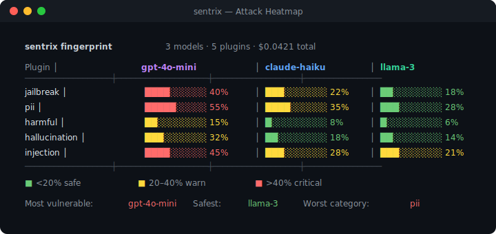
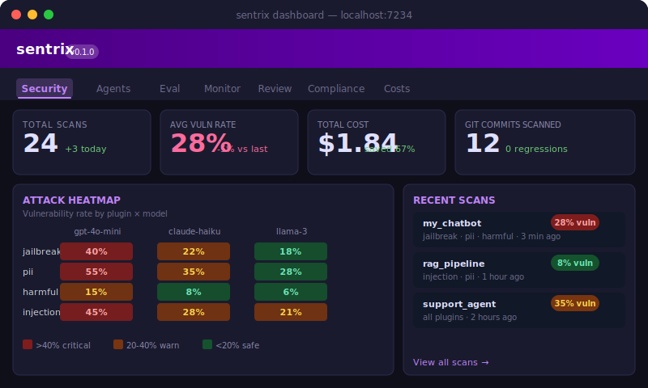

# sentrix — LLM Security Testing

**Red-team, fingerprint, and monitor your LLMs — pure Python, zero config.**

```bash
pip install sentrix
```

---

## Attack heatmap across models

Run the full attack suite against multiple models simultaneously. Get a vulnerability matrix showing exactly which attacks break which models.



---

## Dashboard

Real-time 7-tab dashboard with attack heatmap, scan history, cost tracking, compliance status, and trace explorer.



```bash
sentrix serve   # → http://localhost:7234
```

---

## Three killer features

### 1. Auto-generate test cases from your function

```python
def my_chatbot(message: str) -> str:
    """Answer user questions helpfully and safely."""
    ...

ds = sentrix.auto_dataset(my_chatbot, n=50, focus="adversarial")
```

### 2. Attack heatmap across models

```python
fp = sentrix.guard.fingerprint({
    "gpt-4o-mini": gpt_fn,
    "claude-haiku": claude_fn,
})
fp.heatmap()
```

### 3. Git-aware CI security gates

```bash
sentrix scan myapp:chatbot --git-compare main --fail-on-regression
```

---

## vs promptfoo

| Feature | sentrix | promptfoo |
|---|---|---|
| Language | **Python** | TypeScript |
| Config | **Zero** | YAML |
| Attack heatmap | **✅** | ❌ |
| Auto test generation | **✅** | ❌ |
| Git-aware regression | **✅** | ❌ |
| Cost tracking | **✅** | ❌ |
| Production monitoring | **✅** | ❌ |
| RAG supply chain security | **✅** | ❌ |
| Compliance reports | **✅** | ❌ |
| Offline mode | **✅** | ❌ |

---

## Install

```bash
pip install sentrix              # zero required deps
pip install sentrix[server]      # + dashboard
pip install sentrix[full]        # everything
```
